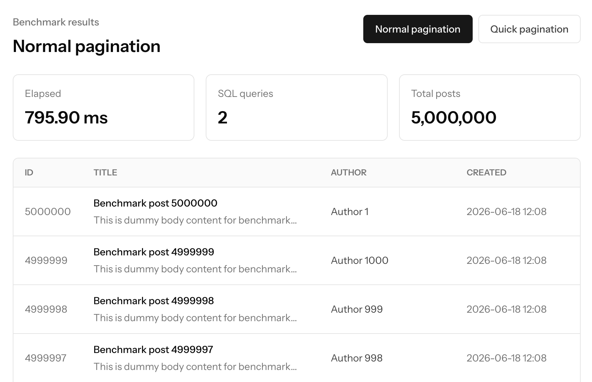
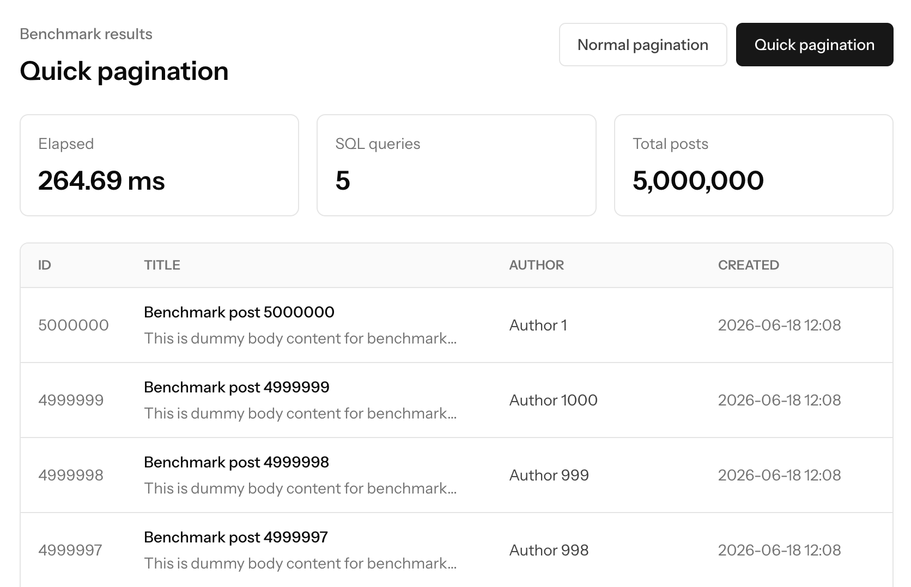

# Laravel Quick Pagination Demo

### English

This is a demo application for the `askdkc/laravel-quick-paginator` package.

It compares Laravel's standard `paginate(50)` with `quickPaginate(50)` using 5 million dummy post records.

Package:
https://packagist.org/packages/askdkc/laravel-quick-paginator

---

### 日本語

これは `askdkc/laravel-quick-paginator` パッケージのデモアプリケーションです。

500万件のダミー投稿データを使用し、Laravel標準の `paginate(50)` と `quickPaginate(50)` のパフォーマンスを比較できます。

パッケージ:
https://packagist.org/packages/askdkc/laravel-quick-paginator

## English

### Benchmark

In this sample run, Quick Pagination completed in **264.69 ms**, while normal pagination took **795.90 ms** against 5 million posts. That is about **3.0x faster**, reducing response time by about **66.7%**.

| Normal pagination | Quick pagination |
| --- | --- |
|  |  |

### Requirements

- PHP 8.4.1 or higher
- Composer
- Node.js and npm
- SQLite

### Installation

```bash
git clone https://github.com/askdkc/laravel-quick-pagination-demo.git
cd laravel-quick-pagination-demo

composer install
cp .env.example .env
php artisan key:generate

touch database/database.sqlite
php artisan migrate
php artisan db:seed --class=PostSeeder

npm install
npm run build
php artisan serve
```

The seeder creates 5 million dummy posts, so it may take a little time and disk space.

Open the demo:

- Home: http://127.0.0.1:8000
- Normal pagination: http://127.0.0.1:8000/posts/pagination
- Quick pagination: http://127.0.0.1:8000/posts/quick-pagination

## 日本語

### ベンチマーク

このサンプル実行では、500万件の投稿に対して通常ページネーションが **795.90 ms**、Quickページネーションが **264.69 ms** でした。Quickページネーションは約 **3.0倍高速** で、応答時間を約 **66.7%短縮** しています。

| 通常ページネーション | Quickページネーション |
| --- | --- |
|  |  |

### 必要なもの

- PHP 8.4.1 以上
- Composer
- Node.js / npm
- SQLite

### インストール

```bash
git clone https://github.com/askdkc/laravel-quick-pagination-demo.git
cd laravel-quick-pagination-demo

composer install
cp .env.example .env
php artisan key:generate

touch database/database.sqlite
php artisan migrate
php artisan db:seed --class=PostSeeder

npm install
npm run build
php artisan serve
```

Seeder は500万件のダミー投稿を作成するため、少し時間とディスク容量が必要です。

デモを開く:

- トップページ: http://127.0.0.1:8000
- 通常ページネーション: http://127.0.0.1:8000/posts/pagination
- Quickページネーション: http://127.0.0.1:8000/posts/quick-pagination
